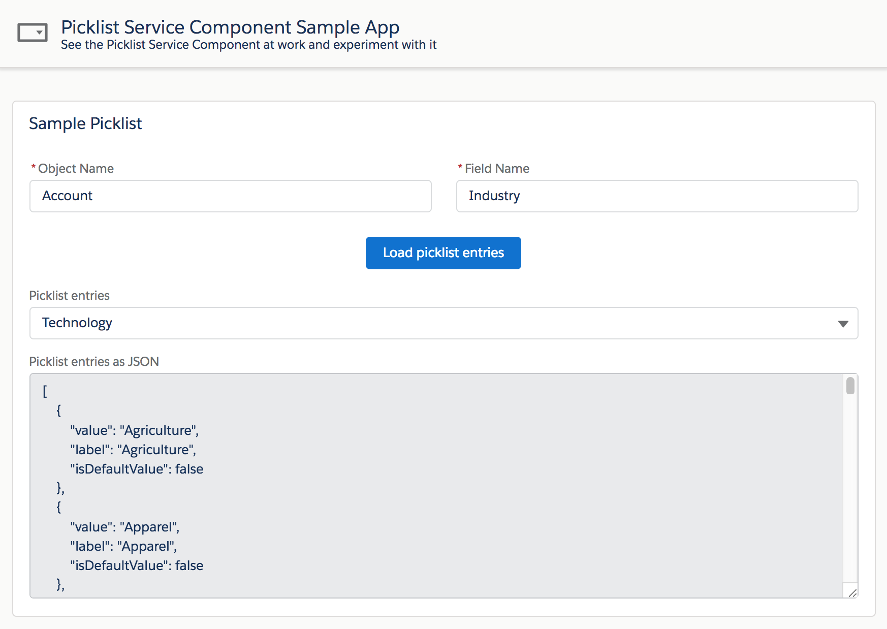

# Salesforce Lightning Picklist Service Component

## About
This is a generic and reusable Lightning component that retrieves any picklist entries.<br/>
This is a service component so it has no user interface of it's own: it is meant to be called by other components.

<b>Features</b>

The component provides the following features:
- fetches picklists for any dynamic object (standard or custom) and field names
- integrated error notifications (developer console + toast notifications in Lightning Experience)
- storable actions for client-side cache

<div align="center">
    
</div>

## Documentation
The component is documented using Aura documentation.<br/>
You can access it from this URL (replace the domain):<br/>
https://<b>&lt;YOUR_DOMAIN&gt;</b>.lightning.force.com/auradocs/reference.app#reference?descriptor=c:PicklistService&defType=component


Use the service by adding the component to a parent component's markup:
```xml
<c:PicklistService aura:id="picklistService"/>
```

Then, simply call the service from the parent's component controller like this:
```js
// Getting picklist entries for Account.Industry field
component.find('picklistService').getEntries('Account', 'Industry', entries => {
    console.log(entries);
});
```

Entries are returned as an Array of JS Object:
```json
[
    {
        "value": "Agriculture",
        "label": "Agriculture",
        "isDefaultValue": false
    },
    ...
]
```

Entries can directly be used in a `lightning:combobox` component:
```xml
<lightning:combobox name="values" label="Picklist entries" options="{!v.entries}"/>
```

## Salesforce DX setup instructions
Deploy the sample application with Salesforce DX by clicking on this button:

[](https://deploy-to-sfdx.com)


## Sample application
The default installation installs the component and a sample application available under this URL (replace the domain):<br/>
https://<b>&lt;YOUR_DOMAIN&gt;</b>.lightning.force.com/c/SamplePicklistApp.app

If you wish to install the project without the sample application, edit `sfdx-project.json` and remove the `src-sample` path.
